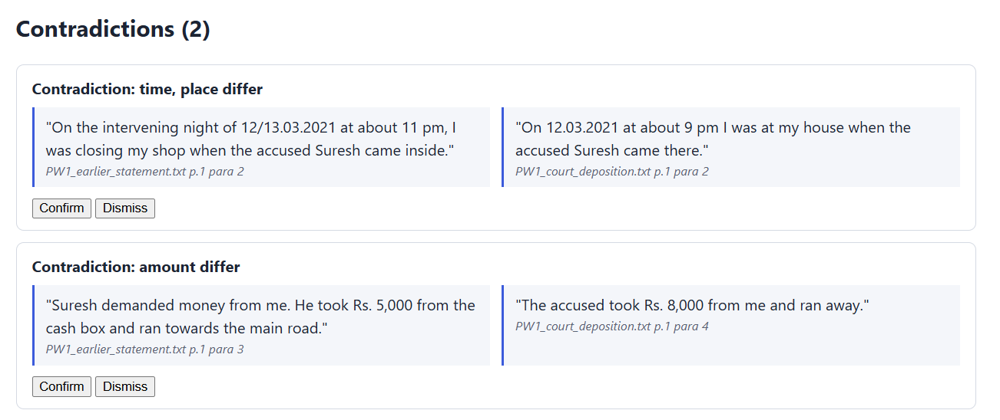
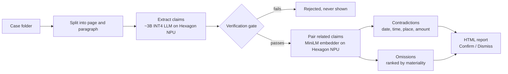
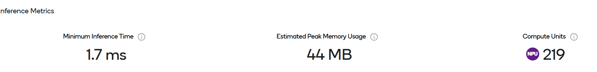
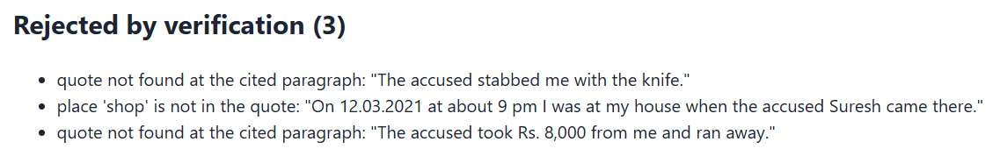

# Nyaya AI

**Offline cross-examination prep for Indian advocates, built for Snapdragon X laptops.**

Nyaya AI reads a case folder and flags where a witness's court testimony **contradicts**, or **leaves out**, something from their earlier police statement. Every quote is checked against the source by code, and no file leaves the laptop.



## Why

- In Indian trials, cross-examination turns on two things:
  - **Contradictions** with a witness's previous statement: s.148 Bharatiya Sakshya Adhiniyam 2023 (formerly s.145 Evidence Act).
  - **Material omissions**, which the law treats as contradictions: Explanation to s.181 BNSS 2023 (formerly s.162 CrPC).
- Advocates find these by reading case files by hand. You can search for what a witness said, but not for what they left out.
- Case files are privileged, so uploading them to cloud AI puts client confidentiality at risk. General AI tools also invent quotes.

## The idea: the LLM proposes, code verifies



A small language model only **extracts** claims. Code checks every claim before the advocate sees it:

| Check | What it stops |
|---|---|
| The quote appears word for word in the **cited** paragraph | Invented quotes, and real quotes cited to the wrong page |
| Every date, time, place and amount appears inside the quote | Details the model made up or mixed up |

## System architecture

| Stage | What it does | Runs on | Status |
|---|---|---|---|
| 1. Parse | Splits each document into `(file, page, paragraph)` so every quote has a citation | CPU | Built |
| 2. Extract | LLM reads each paragraph and outputs claims as JSON | **Hexagon NPU** | Planned (`claims.json` stands in) |
| 3. Verify | Rejects any claim whose quote is not in the cited paragraph, or whose fields are not in the quote | CPU | Built |
| 4. Pair | Embeds claims so related ones can be matched even when worded differently | **Hexagon NPU** | Profiled on AI Hub (below); pairing by event label for now |
| 5. Contradictions | Compares claims about the same event across documents: dates, times, places, amounts | CPU | Built |
| 6. Omissions | Finds events a witness mentioned in one statement but not the other, likely-material first | CPU | Built |
| 7. Report | HTML page with side-by-side quotes and Confirm / Dismiss buttons | CPU | Built |

Claim format produced by the extractor:

```json
{"doc": "PW1_court_deposition.txt", "page": 1, "para": 2, "actor": "Suresh",
 "event": "accused_arrives", "date": "12.03.2021", "time": "9 pm", "place": "house",
 "exact_quote": "On 12.03.2021 at about 9 pm I was at my house when the accused Suresh came there."}
```

## Where the NPU is used

| Stage | Runs on | Why |
|---|---|---|
| Claim extraction (~3B LLM, INT4) | **Hexagon NPU** via Qualcomm Genie | The heaviest step: reads every paragraph of the case |
| Claim pairing (MiniLM embedder, FP16) | **Hexagon NPU** via ONNX Runtime QNN | One vector per paragraph, many paragraphs per case |
| Parse, verify, contradictions, omissions, report | CPU | Deterministic rules, no AI needed |

## Benchmarks

| Model / stage | Device | Latency | Peak memory | Compute units | Source |
|---|---|---|---|---|---|
| all-MiniLM-L6-v2 embedder, seq 128, FP16 | Snapdragon X Elite CRD (SC8380XP), Windows 11 | 1.7 ms per inference, burst mode (first load 624 ms) | 44 MB inference, 67 MB load | **219 / 219 layers on NPU** | [Qualcomm AI Hub profile job](PASTE_PROFILE_JOB_LINK) |
| Llama 3.2 3B or Phi-3.5-mini, INT4 | Snapdragon X Elite | To be profiled | To be profiled | | |

Runtime: ONNX Runtime 1.27.1 with the QNN execution provider, QAIRT 2.45.0. Profiling script: [`benchmarks/profile_embedder.py`](benchmarks/profile_embedder.py).



Next: profile the LLM, measure the full pipeline end to end on a physical Snapdragon X laptop, and compare NPU vs CPU speed and battery use per case.

## Models

| Model | Job | Precision | Runtime | Status |
|---|---|---|---|---|
| all-MiniLM-L6-v2 | Pair related claims | FP16 (INT8 planned) | ONNX Runtime QNN EP, Hexagon NPU | Compiled and profiled on AI Hub |
| Llama 3.2 3B or Phi-3.5-mini (Qualcomm AI Hub) | Claim extraction | INT4 | Qualcomm Genie, Hexagon NPU | Planned |

Models load one stage at a time to fit in laptop memory.

## Dataset

| Data | Use | Status |
|---|---|---|
| `sample_case/`: 3 fictional statements, 11 claims including 3 planted errors | Testing the pipeline | Included |
| Public Indian judgments where courts ruled an omission material or immaterial | Evaluation on real cases | Planned |

No real client data is used or stored.

## Parameters

| Parameter | Value | Why |
|---|---|---|
| Time tolerance | 30 minutes | Statements say "at about"; smaller gaps are not flagged |
| Date matching | Ranges must not overlap | "Intervening night of 12/13.03.2021" covers both days |
| Text normalisation | Lowercase, collapse whitespace | Formatting differences don't fail a real quote |
| Materiality keywords | weapon, knife, threat, injury, kill, eyewitness, identification | Heuristic ranking; the advocate decides |
| Embedder input length | 128 tokens | The NPU needs a fixed input shape |

## Results on the sample case

```
8 verified, 3 rejected, 2 contradictions, 3 omissions -> report.html
```

- **Verification gate:** rejected **3 of 3** planted false claims: an invented quote, a place not in its quote, and a real quote cited to the wrong paragraph.
- **Contradictions:** 11 pm at the shop vs 9 pm at the house; Rs. 5,000 vs Rs. 8,000. "Night of 12/13.03.2021" vs "12.03.2021" is correctly **not** flagged.
- **Omissions:** a knife threat said for the first time in Court and an eyewitness not mentioned in Court (both likely material); a trip to the police station not repeated in Court (check materiality).



## Metrics

| Metric | Definition | Current value |
|---|---|---|
| Gate catch rate | Planted false claims rejected ÷ planted | 3 / 3 on the sample case |
| Gate pass rate | Extractor claims that pass verification ÷ all claims | To be measured with the real LLM |
| Contradiction / omission recall | Real findings detected ÷ findings in labelled cases | To be measured on public judgments |
| False flags | Findings the advocate dismisses | To be measured |

## Run it

Python 3.10+, standard library only.

```
python nyaya.py
```

Then open `report.html` in a browser.

To reproduce the NPU benchmark (needs a free Qualcomm AI Hub account):

```
pip install qai-hub torch transformers
qai-hub configure --api_token YOUR_TOKEN
python benchmarks/profile_embedder.py
```

## Repository

```
nyaya.py                  pipeline: load, verify, compare, find omissions, build report
report_template.html      report layout
sample_case/              fictional case: statements, case.json, claims.json
benchmarks/               Qualcomm AI Hub profiling script
docs/                     screenshots
```

## Dependencies

- Prototype: Python 3.10+, standard library only (`re`, `json`, `html`, `string`, `pathlib`, `datetime`)
- Benchmark: `qai-hub`, `torch`, `transformers`
- Planned NPU stages: Qualcomm AI Hub, Qualcomm Genie, ONNX Runtime with the QNN execution provider

## Out of scope for now

OCR for scanned chargesheets, Indian languages, chat, and any cloud feature.

## Disclaimer

Every finding is a draft for the advocate to confirm or dismiss. Nyaya AI does not give legal advice.
